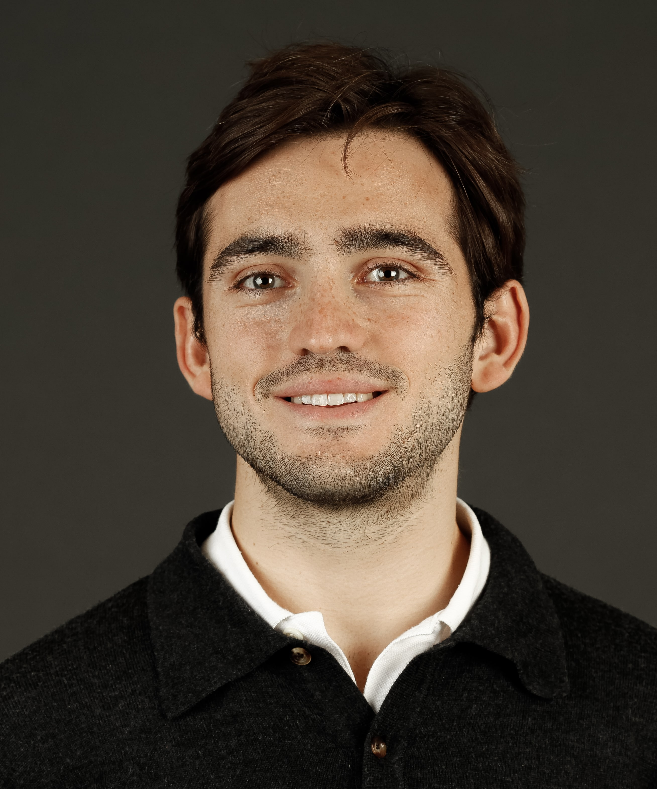

I am a PhD candidate at the **[Large-Scale Data & Systems Group](https://lsds.doc.ic.ac.uk/)** from the Imperial College London under the supervision of [Peter Pietzuch](https://www.doc.ic.ac.uk/~prp/).
My research interests cover systems, security, containers, and virtualization.

I am also doing research for the **Complex Systems Group** of the Institut d'Informatique of the Université de Neuchâtel (IIUN) and for the **Computer Architecture Department** of the Technical University of Catalonia.

---

## About Me

My main research interests lie in the broad area of **systems**, **security**, and **networking**, with a strong mathematical foundation.
I am also highly interested in **formal methods**, verification and synthesis.

As a researcher at the IIUN, and under the supervision of [Valerio Schiavoni](http://members.unine.ch/valerio.schiavoni/), I am actively doing research with [Trusted Execution Environments](https://en.wikipedia.org/wiki/Trusted_execution_environment), namely [Intel SGX](https://en.wikipedia.org/wiki/Software_Guard_Extensions) and [Arm TrustZone](https://developer.arm.com/ip-products/security-ip/trustzone), and working on network emulation tools with the [Angainor Project](https://angainor.science).

For my MSc thesis, and with a grant of the [Department of Computer Architecture](https://www.ac.upc.edu/en/about-us), I am working on live migration of distributed container deployments using [checkpoint/restore](https://criu.org/Main_Page).
You can follow the development of the project in the [Github repo](https://github.com/lm-docker/criu-demos).

## Publications

1. P. Gouveia, J. Neves, C. Segarra, L. Liechti, S. Issa, V. Schiavoni, and M. Matos **_Kollaps: Decentralized and Dynamic Topology Emulation_**. EuroSys 2020. Crete, Greece. April 27-30 2020. \\
[[DOI](https://dl.acm.org/doi/abs/10.1145/3342195.3387540) | [arXiv](https://arxiv.org/abs/2004.02253) | [Cite]({{ site.url }}/assets/papers/EUROSYS2020_Kollaps.bib) | [PDF]({{ site.url }}/assets/papers/EUROSYS2020_Kollaps.pdf)]
1. C. Segarra, R. Delgado-Gonzalo, and V. Schiavoni (2019) **_"MQT-TZ: Secure MQTT Broker for Biomedical Signal Processing on the Edge"_**. MIE 2020, Geneva, Switzerland. May 19-20, 2020. \\
[[DOI](https://doi.org/10.3233/shti200177) | [arXiv](https://arxiv.org/abs/2007.01555) | [Cite]({{ site.url }}/assets/papers/MIE2020_MQTTZ.bib) | [PDF]({{ site.url }}/assets/papers/MIE2020_MQTTZ.pdf)]
2.  C. Segarra, E. Muntan\'e, M. Lemay, V. Schiavoni, and  R. Delgado-Gonzalo (2019) **_Secure Stream Processing for Medical Data_**. IEEE EMBC 2019.\\
[[DOI](https://doi.org/10.1109/EMBC.2019.8856334) | [arXiv](https://arxiv.org/abs/1907.12242) | [Cite]({{ site.url }}/assets/papers/EMBC2019_SecureStreamProcessing.bib) | [PDF]({{ site.url }}/assets/papers/EMBC2019_SecureStreamProcessing.pdf)]
3. C. Segarra, R. Delgado-Gonzalo, M. Lemay, P-L. Aublin, P. Pietzuch, and V. Schiavoni (2019) **_Using Trusted Execution Environments for Secure Stream Processing of Medical Data_**. In: Pereira J., Ricci L. (eds) Distributed Applications and Interoperable Systems. DAIS 2019. Lecture Notes in Computer Science, vol 11534.\\
[[DOI](https://doi.org/10.1007/978-3-030-22496-7_6) | [arXiv](https://arxiv.org/abs/1906.07072) | [Cite]({{ site.url }}/assets/papers/DAIS2019_UsingTEE.bib) | [PDF]({{ site.url }}/assets/papers/DAIS2019_UsingTEE.pdf)]

## Education

* **PhD in Computing** LargeScale Data & Systems Group - Imperial College London \\
  Starting Date October 2020\\
  (Advisor: Peter Pietzuch) 

* **MSc in Advanced Mathematics** Technical University of Catalonia (UPC) \\
  September 2019 - July 2019 (Expected Graduation: July 2020)\\
  MSc Thesis: _Live Migration of Distributed Container Deployments_\\
  (Advisor: Jordi Guitart)

* **BSc in Mathematics** Technical University of Catalonia (UPC) \\
  September 2014 - May 2019 \\
  BSc Thesis: _Using Trusted Execution Environments for Secure Stream Processing of Medical Data_ (Advisors: Ricard Delgad-Gonzalo, José Adrián Rodríguez Fonollosa)\\
[[URI](http://hdl.handle.net/2117/169114) | [arXiv](broken) | [Cite]({{ site.url }}/assets/papers/SegarraGonzalez_Carlos_TFG.bib) | [PDF]({{ site.url }}/assets/papers/SegarraGonzalez_Carlos_TFG.pdf)]

* **BSc in Telecommunications Engineering** Technical University of Catalonia (UPC) \\
  September 2014 - May 2019 \\
  BSc Thesis: _Using Trusted Execution Environments for Secure Stream Processing of Medical Data_ (Advisors: Ricard Delgad-Gonzalo, José Adrián Rodríguez Fonollosa)\\
[[URI](http://hdl.handle.net/2117/169114) | [arXiv](broken) | [Cite]({{ site.url }}/assets/papers/SegarraGonzalez_Carlos_TFG.bib) | [PDF]({{ site.url }}/assets/papers/SegarraGonzalez_Carlos_TFG.pdf)]

## Work Experience

* **Research Collaborator** Computer Architecture Department - Technical University of Catalonia \\
  October 2019 - Present\\
  Supervisor: Jordi Guitart

* **Full-Stack Web Developer** Alumniverse \\
  January 2020 - June 2020 \\
  Technologies used: PHP-Laravel and VueJS

* **Research Assistant** Complex Systems Group - Institut d'Informatique (Université de Neuchâtel)\\
  August 2019 - December 2019\\
  Supervisor: Valerio Schiavoni

* **Trainee** Embedded Software Group - Swiss Center for Electronics and Microtechnology\\
  October 2018 - July 2019\\
  Supervisor: Ricard Delgado

* **Summer Intern** Cybersecurity Group - Nokia Bell Labs\\
  June 2018 - September 2018\\
  Supervisors: Matteo Pontecorvi, Matteo Signorgini

* **Research Student** Workflows and Distributed Computing Group - Barcelona Supercomputing Center\\
  April 2017 - June 2018\\
  Supervisor: Rosa Badia
